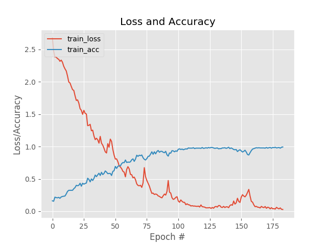

# Blues Generator

Recurrent Neural Network (RNN) generating blues music from a MIDI file.

## Description

This project is divided into two parts:

* The training part: trains the model from the input MIDI file
* The generator part: creates a MIDI output file containing an AI generated blues song. 

The project was made with the deep learning framework Keras.

Feel free to leave remarks on how to improve the model even more.

## Installation

   * Install pip
   * create a virtual environment using python 3
   * run the command:
       ```
       pip install -r requirements.txt
       ```
You can find many guides on pip, python and virtualenv on the web.
    
## Training process

The model is trained on 200 epochs. It uses the Adam optimizer for gradient descent.

```
Usage: python src/train_nn.py

  -f, --file                the MIDI file from which the new song will me generated  
  -p, --plot                path to output accuracy/loss plot (default: output/plot.png)  
  -s, --sequence_length     number of notes in music to take in account when generating a new note (default: 100 notes)
```

The program will then ask the desired instrument for music generation, for example:

```
Please select one of the instrument for music generation:
	Acoustic Bass
	Piano
	Saxophone
:
```

### Model loss/accuracy

* Accuracy and Loss:

    
   
## Blues Generator

```
Usage: python src/blues_generator.py

  -m, --model              path to neural network model  
  -n, --notes              path to notes generated by training
  -p, --partition_info     information about the partition on which the training was performed
```

### A few music generation examples

You can hear some examples there:

   * Blues Bass: https://soundcloud.com/louis-cailleux/generated-blues-bass/s-2X9Kr

## Possible improvements

* Add beginnings and endings to music
* Support varying duration of notes and different offsets between notes
    
## Authors and acknowledgment

This program was inspired by the article posted on Medium by Sigurður Skúli:

https://towardsdatascience.com/how-to-generate-music-using-a-lstm-neural-network-in-keras-68786834d4c5

Many thanks to him !

## License
[MIT](https://choosealicense.com/licenses/mit/)